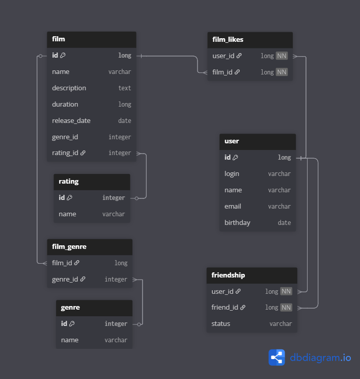

# java-filmorate
Template repository for Filmorate project.

---

## ER-Диаграмма


---

## *Примеры запросов по основным операциям*

+ **Найти фильм по id**

```sql
SELECT f.name
FROM film AS f
WHERE id = *film_id*;
```

+ **Топ N фильмов по оценкам пользователей**

```sql
SELECT film.id, film.name, COUNT(fl.user_id) AS like_count
FROM film AS f
LEFT JOIN  film_likes AS fl ON f.id = fl.film_id
GROUP BY film.id, film.name
ORDER BY like_count DESC
LIMIT *N*;
```

+ **Найти пользователя по id**

```sql
SELECT u.name
FROM user AS u
WHERE id = *user_id*;
```

+ **Найти друзей пользователя**

```sql
SELECT u.*
FROM user u
JOIN friendship f ON u.id = f.user_id_2
WHERE f.user_id_1 = 1;
```
